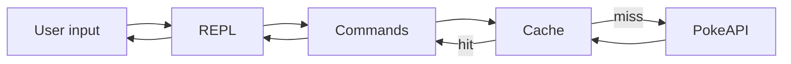

# PokeDex CLI — Project Description

This repo is the **Boot.dev "Build a Pokedex in TypeScript"** guided project. It is a command-line Pokedex: an interactive REPL that fetches Pokémon data from the **PokeAPI**, with an **in-memory cache** to reduce network calls. Use this file as the single source of truth for what the project is and what to build.

---

## 1. Overview

- **What:** A Pokedex-style REPL (Read–Eval–Print Loop) in TypeScript that runs in the terminal.
- **Data source:** [PokeAPI](https://pokeapi.co/) over HTTPS (JSON).
- **Optimization:** In-memory cache for API responses.
- **Context:** Part of the Boot.dev course [Build a Pokedex in TypeScript](https://www.boot.dev/courses/build-pokedex-cli-typescript).

---

## 2. Domain / Architecture

**Core pieces:**

| Component    | Role |
|-------------|------|
| **REPL**    | Interactive loop: read user input → evaluate (run a command) → print result. |
| **Cache**   | In-memory cache keyed by request/URL; returns cached response when available to avoid repeated PokeAPI calls. |
| **Pokedex CLI** | Commands that use the REPL and the cache to explore locations, catch Pokémon, inspect them, and list caught Pokémon. |

**External dependency:** PokeAPI (HTTPS, JSON).

**High-level flow:**

---

## 3. Requirements / Deliverables

Summarized by course chapter. Refer to the Boot.dev course for full lesson details.

**Chapter 1 — REPL**

- Implement an interactive REPL in TypeScript.
- Read user input, evaluate it (e.g. as a command), and print the result.
- Loop until the user exits.

**Chapter 2 — Cache**

- Implement an in-memory cache for PokeAPI responses.
- Use it to avoid redundant network requests (e.g. cache by URL or request key).
- Consider TTL or eviction if specified in the course.

**Chapter 3 — Pokedex**

- Combine REPL and cache into a full Pokedex CLI.
- Typical commands (align with course spec): `help`, `exit`, `map`, `mapb`, `explore`, `catch`, `inspect`, `pokedex`.
- Wire commands to PokeAPI and the cache.

---

## 4. Workspace File Map

| Purpose              | Location |
|----------------------|----------|
| Project spec & requirements | This file: `PROJECT_DESC.md` |
| Package and scripts  | `package.json` |
| App source code      | e.g. `src/` or root `*.ts` (to be added) |
| Cursor / AI rules    | `.cursorrules`, `.cursor/` |
| GitHub / quick start | `README.md` |

Use `PROJECT_DESC.md` and the Boot.dev course as the source of truth when implementing or reviewing behavior.
