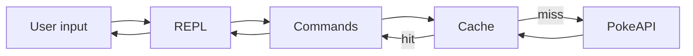

# PokeDex CLI (TypeScript)

> 🚧 **Under Construction** – This project is actively being developed. Some features are complete, while others are still in progress. See the [Implementation Status](#implementation-status) section for details.

Interactive terminal Pokedex CLI in TypeScript - a REPL that fetches Pokemon data from [PokeAPI](https://pokeapi.co/) with in-memory caching. Built as part of the Boot.dev course [Build a Pokedex in TypeScript](https://www.boot.dev/courses/build-pokedex-cli-typescript).

---

## 📑 Table of Contents

- [Implementation Status](#implementation-status)
- [1. Project Goals](#1--project-goals)
- [2. Required Components](#2--required-components)
  - [2.1 Chapter 1 - REPL](#21-chapter-1---repl)
  - [2.2 Chapter 2 - Cache](#22-chapter-2---cache)
  - [2.3 Chapter 3 - Pokedex Commands](#23-chapter-3---pokedex-commands)
- [3. Completed Modules](#3--completed-modules)
  - [3.1 Project Scaffold](#31-project-scaffold)
  - [3.2 REPL Module (Chapter 1)](#32-repl-module-chapter-1)
- [4. Pending Modules](#4--pending-modules)
- [5. Build & Run Instructions](#5--build--run-instructions)
  - [5.1 Prerequisites](#51-prerequisites)
  - [5.2 Install and Run](#52-install-and-run)
- [6. Architecture](#6--architecture)
- [7. Definition of Done for MVP](#7--definition-of-done-for-mvp)
- [8. Next Steps](#8--next-steps)
- [9. Authors](#9--authors)

---

## 📊 Implementation Status

| Component        | Status   | Description                                                       |
| ---------------- | -------- | ----------------------------------------------------------------- |
| Project scaffold | Complete | TypeScript setup, package.json, tsconfig                          |
| REPL             | Complete | Interactive read-eval-print loop with shared state for pagination |
| PokeAPI client   | Complete | `fetchLocations` for paginated location-area data                 |
| Cache            | Pending  | In-memory PokeAPI response cache                                  |
| Pokedex CLI      | Partial  | `help`, `exit`, `map`, `mapb` done; explore, catch, inspect, pokedex pending |

---

## 1. 🎯 Project Goals

1. Accept user commands in a terminal REPL.
2. Fetch Pokemon-related data from PokeAPI over HTTP/JSON.
3. Cache API responses in memory to reduce redundant network calls.
4. Support map exploration, catching, inspecting, and listing caught Pokemon.

---

## 2. 🧩 Required Components

### 2.1 Chapter 1 - REPL

- [x] Implement an interactive REPL in TypeScript.
- [x] Read user input, evaluate it (as a command), and print the result.
- [x] Loop until the user exits.

### 2.2 Chapter 2 - Cache

- [ ] Implement an in-memory cache for PokeAPI responses.
- [ ] Use it to avoid redundant network requests (e.g. cache by URL or request key).
- [ ] Consider TTL or eviction if specified in the course.

### 2.3 Chapter 3 - Pokedex Commands

- [ ] Combine REPL and cache into a full Pokedex CLI.
- [ ] Wire commands to PokeAPI and the cache.

**Commands:**

| Command  | Status   | Description                          |
| -------- | -------- | ------------------------------------ |
| `help`   | Complete | Show available commands              |
| `exit`   | Complete | Exit the application                 |
| `map`    | Complete | Show next 20 location-area names     |
| `mapb`   | Complete | Show previous 20 location-area names |
| `explore`| Pending  | Explore a location for Pokemon       |
| `catch`  | Pending  | Attempt to catch a Pokemon           |
| `inspect`| Pending  | Inspect a caught Pokemon             |
| `pokedex`| Pending  | List all caught Pokemon              |

---

## 3. ✅ Completed Modules

### 3.1 Project Scaffold

**Status**: Complete.

**Files**:

- `package.json` - Package config, npm scripts (build, start, dev)
- `tsconfig.json` - TypeScript configuration
- `src/main.ts` - Entry point

**Features**:

- TypeScript compilation setup
- ESM module support
- npm scripts: `build`, `start`, `dev`
- Node.js 18+ compatibility

### 3.2 REPL Module (Chapter 1)

**Status**: Complete.

**Files**:

- `src/repl.ts` - Core REPL logic (cleanInput, executeCommand, startREPL)
- `src/state.ts` - State type, CLICommand type, initState, command registry
- `src/command_help.ts` - `help` command
- `src/command_exit.ts` - `exit` command
- `src/command_map.ts` - `map` command (forward pagination)
- `src/command_mapb.ts` - `mapb` command (backward pagination)

**Features**:

- Interactive readline loop with `Pokedex > ` prompt
- Input normalization (trim, lowercase, split by whitespace)
- Command routing and unknown-command handling
- Dynamic help listing from the command registry
- Graceful exit with readline cleanup
- Shared state for pagination (mutations persist across command invocations)
- Error handling via try-catch with `console.error` for thrown commands

### 3.3 PokeAPI Module

**Status**: Complete (fetchLocations); `fetchLocation` stub pending.

**Files**:

- `src/pokeapi.ts` - PokeAPI client, `fetchLocations`, `ShallowLocation` / `ShallowLocations` types

**Features**:

- HTTP client for PokeAPI v2
- `fetchLocations(pageURL?)` - Paginated location-area list (20 per page)
- `fetchLocation(name)` - Stub for single location details (not yet implemented)

**Example Usage**:

```bash
npm install
npm run build
npm start
```

Then type `help`, `map`, `mapb`, or `exit` in the REPL. Use `map` repeatedly to paginate forward; use `mapb` to go back. Or use `npm run dev` to build and run in one step.

---

## 4. ⏳ Pending Modules

### 4.1 Cache Module

- [ ] In-memory cache keyed by URL or request key.
- [ ] Cache hit/miss logic to avoid repeated PokeAPI calls.
- [ ] TTL or eviction (if applicable per course spec).

### 4.2 Pokedex Module

- [ ] Remaining commands (`explore`, `catch`, `inspect`, `pokedex`) — `help`, `exit`, `map`, `mapb` are done.
- [ ] PokeAPI `fetchLocation(name)` implementation for explore/catch flow.
- [ ] Integration with cache (when implemented).
- [ ] In-memory storage for caught Pokemon.

---

## 5. 🛠️ Build & Run Instructions

### 5.1 Prerequisites

- **Node.js** (18+ or 20+)
- **npm**

### 5.2 Install and Run

```bash
npm install
```

Build and run:

```bash
npm run build
npm start
```

Or use `npm run dev` to build and run in one step.

---

## 6. 🏗️ Architecture

High-level data flow:



For detailed architecture, see [PROJECT_DESC.md](PROJECT_DESC.md).

---

## 7. ✅ Definition of Done for MVP

| Requirement                          | Status    |
| ------------------------------------ | --------- |
| [x] Project scaffold and build setup | Complete  |
| [x] REPL implemented                 | Complete  |
| [x] PokeAPI client (fetchLocations)  | Complete  |
| [ ] In-memory cache for PokeAPI      | Pending   |
| [x] `help` command                   | Complete  |
| [x] `exit` command                   | Complete  |
| [x] `map` / `mapb` commands          | Complete  |
| [ ] `explore` command                | Pending   |
| [ ] `catch` command                  | Pending   |
| [ ] `inspect` command                | Pending   |
| [ ] `pokedex` command                | Pending   |

---

## 8. 🗓️ Next Steps

### Immediate Priority

1. [x] **REPL (Chapter 1)** - Implement interactive read-eval-print loop. ✅ Done
2. [x] **PokeAPI integration** - fetchLocations for map/mapb. ✅ Done
3. [ ] **Cache (Chapter 2)** - Implement in-memory PokeAPI response cache.
4. [ ] **Pokedex (Chapter 3)** - Implement `explore`, `catch`, `inspect`, `pokedex` and wire to PokeAPI.

### Reference

- Course: [Build a Pokedex in TypeScript](https://www.boot.dev/courses/build-pokedex-cli-typescript)
- Architecture and requirements: [PROJECT_DESC.md](PROJECT_DESC.md)

---

## 9. 👥 Authors

- **Amer Abuyaqob**

---

**License**: ISC

**Last Updated**: REPL complete with `help`, `exit`, `map`, and `mapb`. PokeAPI client integrated for location-area pagination. Cache and remaining commands (`explore`, `catch`, `inspect`, `pokedex`) pending.
